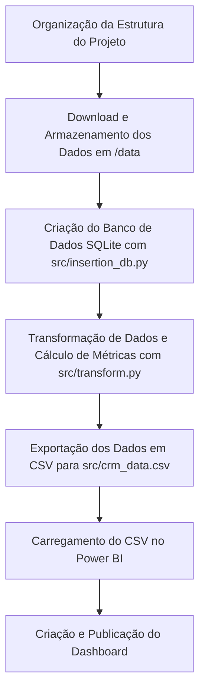

# Projeto: Geração de Métricas de CRM com Olist

Este projeto utiliza dados do dataset Olist para calcular métricas importantes para um relatório de CRM, armazená-las em um banco de dados SQLite e exportá-las para um arquivo CSV, que pode ser usado no Power BI para criar dashboards.

---

## Fluxo do Projeto



---

## Estrutura de Diretórios

```plaintext
.
├── data/                  # Pasta para os arquivos do dataset e arquivos gerados
│   ├── olist_customers_dataset.csv             # Dados de clientes
│   ├── olist_orders_dataset.csv                # Dados de pedidos
│   ├── olist_order_items_dataset.csv           # Dados de itens
├── src/                   # Scripts Python e banco de dados SQLite
│   ├── crm_data.csv       # Arquivo CSV gerado com as métricas de CRM
│   ├── insertion_db.py    # Script para inserir os dados no SQLite
│   ├── olist_crm.db       # Banco de dados SQLite criado
│   ├── transform.py       # Script para calcular as métricas de CRM
├── .gitignore             # Arquivo para ignorar arquivos no versionamento
├── README.md              # Documentação do projeto
├── requirements.txt       # Dependências do projeto
```

---

## Requisitos

- Python 3.8 ou superior
- Bibliotecas Python:
  - pandas
  - sqlite3
- Power BI Desktop (para criação de dashboards)

---

## Configuração e Execução

1. Clone este repositório:

   ```bash
   git clone https://github.com/seu-usuario/seu-repositorio.git
   cd seu-repositorio
   ```

2. Instale as dependências necessárias:

   ```bash
   pip install -r requirements.txt
   ```

3. Coloque os arquivos do dataset Olist na pasta `data/`.

4. Execute o script para criar o banco de dados SQLite:

   ```bash
   python src/insertion_db.py
   ```

5. Calcule e exporte as métricas de CRM:

   ```bash
   python src/transform.py
   ```

6. O arquivo `crm_data.csv` será gerado na pasta `src/`.

7. Importe o arquivo CSV no Power BI e crie o dashboard.

---

## Dashboard

Adicione o link para o seu dashboard Power BI aqui:

[Dashboard CRM](#)

---

## Métricas Calculadas

As seguintes métricas são calculadas e exportadas:
- **Receita Total por Cliente** (`total_revenue`)
- **Frequência de Compra** (`purchase_frequency`)
- **Valor Médio por Pedido** (`avg_order_value`)
- **Recência** (`recency`)

---

## Contribuição

Contribuições são bem-vindas! Siga os passos abaixo para colaborar:
1. Faça um fork do projeto.
2. Crie uma branch para sua feature/bugfix: `git checkout -b minha-feature`.
3. Faça o commit das suas alterações: `git commit -m 'Minha nova feature'`.
4. Faça o push para a branch: `git push origin minha-feature`.
5. Abra um Pull Request.

---

## Licença

Este projeto está licenciado sob a [MIT License](LICENSE).
